# Desafio Final — Lançar um produto novo da Tegra em 90 minutos

## O cenário
A diretoria decidiu: em 30 dias, vamos lançar um novo módulo do nosso software — **Gestão de Contratos Inteligente**.

## Objetivo do desafio
Construir um pacote de lançamento enxuto, coerente e executável para o novo módulo, cobrindo visão de negócio, produto, técnica e risco.

## Entregáveis obrigatórios
### 1) Pitch comercial
- Formato: 3 slides
- Conteúdo mínimo: proposta de valor + precificação

### 2) Vaga de PM
- Formato: descrição de vaga
- Conteúdo mínimo: perfil para contratar o(a) Product Manager do módulo

### 3) Projeção de 12 meses
- Formato: planilha
- Conteúdo mínimo: CAC, LTV, receita projetada, breakeven

### 4) Riscos e QA plan
- Formato: documento curto
- Conteúdo mínimo: top 5 riscos do lançamento + plano de mitigação

### 5) Mockup técnico
- Formato: diagrama + texto breve
- Conteúdo mínimo: arquitetura proposta + stack sugerido

## Critérios de qualidade
- Clareza e objetividade nas decisões
- Consistência entre estratégia comercial, produto e tecnologia
- Premissas financeiras explícitas
- Riscos com mitigação prática
- Viabilidade para lançamento em 30 dias

## Fluxo do projeto (frontend-only)

